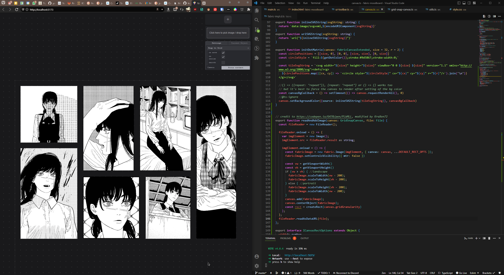

# fabric-moodboard
> a imagebaord/moodboard maker built with fabric.js, canvas, typescript and vite
> allows to arrange images into a collage, grid or masonry layout
  

# work in progress
the app is work in progress.